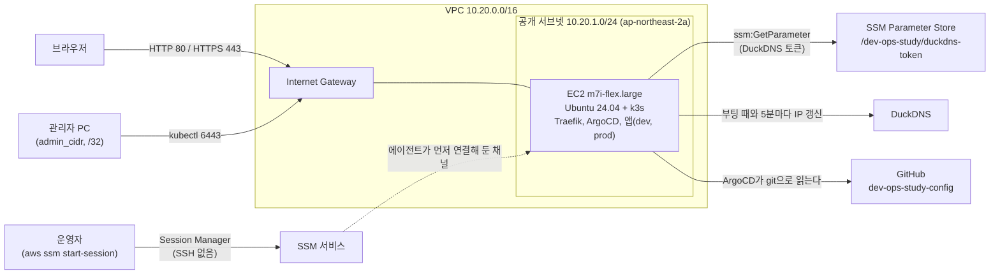

# infra/aws: EC2 한 대에 k3s와 ArgoCD를 올리는 Terraform

공부용 URL 단축 서비스를 AWS에서 돌려 보는 스택이다. EC2 인스턴스 한 대가 부팅하면서 스스로 k3s를 설치하고, ArgoCD를 깔고, 이 저장소의 `argocd/root.yaml`을 적용한다.
그 뒤는 로컬 클러스터와 같은 GitOps 흐름이다: ArgoCD가 이 저장소의 `main`을 읽어 dev·prod 앱을 배포한다.

**쓸 때 만들고, 안 쓸 때는 반드시 `terraform destroy`한다.** 인스턴스는 켜 둔 시간만큼 과금된다(아래 [비용](#비용)).
NAT Gateway, 로드 밸런서(ALB/NLB), EKS는 쓰지 않는다. 인스턴스는 한 대이고 고가용성은 목표가 아니다.

## 구성도



- **들어오는 길은 셋이다.** 80·443(누구나), 6443(k3s API, 내 IP 하나만), 그리고 SSM Session Manager. SSM은 인스턴스의 SSM 에이전트가 밖으로 먼저 연결을 걸어 두는 방식이라 인바운드 포트가 필요 없다. 22번(SSH)은 열지 않고 키 페어도 없다.
- **나가는 길은 IGW 하나다.** NAT Gateway가 없어서 인스턴스가 공인 IPv4를 직접 받는다(공개 서브넷). 공인 IP는 Elastic IP가 아니라 자동 할당이라 인스턴스를 멈췄다 시작하면 바뀌고, DuckDNS 업데이터가 이름을 새 IP로 갱신한다.
- **ArgoCD UI는 공개 주소가 없다.** 지금은 HTTPS가 없어서 공개하면 admin 비밀번호가 평문으로 인터넷을 지난다. `kubectl port-forward`로만 접속한다([접속하기](#접속하기)). HTTPS(cert-manager)가 붙은 뒤에 공개 Ingress를 다시 만든다.

## 파일별로 만드는 것

| 파일 | 내용 |
|---|---|
| `versions.tf` | Terraform `~> 1.16`, AWS 프로바이더 `~> 6.66`(정확한 버전은 잠금 파일) |
| `backend.tf` | S3 상태 백엔드(부분 구성: 버킷 이름은 `init` 때 넘긴다), S3 자체 잠금 |
| `providers.tf` | AWS 프로바이더, `default_tags`(`Project=dev-ops-study`, `ManagedBy=terraform`) |
| `variables.tf` | 입력 변수와 검증 |
| `network.tf` | VPC(10.20.0.0/16), 공개 서브넷(10.20.1.0/24, `<리전>a`), 인터넷 게이트웨이, 라우트 테이블(0.0.0.0/0 → IGW), 연결 |
| `security.tf` | 보안 그룹: 80·443은 전체, 6443은 `admin_cidr`만, 22 없음, 아웃바운드 전체 |
| `iam.tf` | EC2용 역할, `AmazonSSMManagedInstanceCore` 연결, DuckDNS 토큰 읽기용 인라인 정책, 인스턴스 프로파일 |
| `ec2.tf` | Ubuntu 24.04 AMI 조회(Canonical의 SSM 공개 파라미터), 인스턴스 1대(IMDSv2 필수, gp3 30 GiB 암호화) |
| `cloud-init.yaml.tftpl` | 인스턴스가 첫 부팅에 실행하는 설정: DuckDNS 갱신, k3s, Helm, ArgoCD 설치, 네임스페이스와 DB Secret, 루트 Application 적용 |
| `outputs.tf` | 인스턴스 ID, 공인 IP, 앱 주소, SSM 셸 명령, kubeconfig와 ArgoCD 접속 안내 |
| `.terraform.lock.hcl` | 프로바이더 버전과 해시 고정(darwin_arm64, linux_amd64). 커밋한다 |

Terraform이 만드는 리소스는 15개다: VPC, IGW, 서브넷, 라우트 테이블, 테이블 연결, 보안 그룹, 보안 그룹 규칙 4개, IAM 역할, 관리형 정책 연결, 인라인 정책, 인스턴스 프로파일, EC2 인스턴스.

입력 변수:

| 변수 | 기본값 | 설명 |
|---|---|---|
| `duckdns_subdomain` | (필수) | DuckDNS 서브도메인. `.duckdns.org` 없이 |
| `admin_cidr` | (필수) | k3s API(6443)에 접속할 내 IP. 반드시 `/32` |
| `region` | `ap-northeast-2` | 리소스를 만들 리전 |
| `instance_type` | `m7i-flex.large` | 2 vCPU, 8 GiB |
| `k3s_version` | `v1.35.5+k3s1` | 로컬 k3d와 같은 버전 |
| `helm_version` | `v4.3.0` | ArgoCD 설치에만 쓰는 도구 |
| `argocd_chart_version` | `10.9.4` | `bootstrap/argocd/values.yaml`이 가정하는 차트 버전 |
| `duckdns_token_parameter` | `/dev-ops-study/duckdns-token` | 토큰을 담은 SSM 파라미터 이름(`/`로 시작) |
| `config_repo_url` | `https://github.com/seongj-un/dev-ops-study-config` | 부팅 중에 루트 Application을 가져올 저장소 |
| `config_repo_ref` | `main` | 그 저장소의 브랜치 또는 태그 |

출력: `instance_id`, `public_ip`, `urls`(prod, dev), `ssm_shell_command`, `kubeconfig_fetch_hint`, `argocd_access`.

## 준비물

1. **부트스트랩 스택을 적용해 둔다**(`infra/bootstrap`). 그 스택이 Terraform 상태를 담을 S3 버킷 `dev-ops-study-tfstate-<계정 ID>`와 예산 알림(월 $5 조기 경보, 월 $20 한도)을 만든다. 이 스택(`infra/aws`)은 그 버킷을 쓰기만 한다.
2. **DuckDNS 서브도메인과 토큰.** https://www.duckdns.org 에 로그인해 서브도메인을 하나 만들면 페이지 위쪽에 토큰이 보인다.
3. **토큰을 SSM Parameter Store에 SecureString으로 저장한다.** 인스턴스가 부팅할 때 이 값을 읽는다. 토큰은 Terraform 변수나 `user_data`에 넣지 않으므로 상태에도 남지 않는다.
   ```bash
   read -rs DUCKDNS_TOKEN        # 입력이 화면에 보이지 않는다. 토큰을 붙여 넣고 Enter
   aws ssm put-parameter --region ap-northeast-2 --name /dev-ops-study/duckdns-token \
     --type SecureString --value "$DUCKDNS_TOKEN"
   unset DUCKDNS_TOKEN
   ```
   - `--key-id`를 주지 않으면 기본 키(AWS 관리형 `aws/ssm`)로 암호화된다. `iam.tf`의 정책은 이 키를 전제로 한다.
   - 파라미터는 리전 단위라서 `var.region`과 같은 리전에 만든다.
   - 이 순서가 중요한 이유: `iam.tf`가 `aws/ssm` 키의 별칭을 조회하는데, 그 키는 기본 키로 SecureString을 처음 쓸 때 만들어진다. 기본 키로 SecureString을 만든 적이 없는 새 계정이면 `plan`이 이 조회에서 실패한다.
4. **로컬 도구**: Terraform 1.16.x, AWS CLI v2, [Session Manager 플러그인](https://docs.aws.amazon.com/systems-manager/latest/userguide/session-manager-working-with-install-plugin.html)(`brew install --cask session-manager-plugin`), kubectl.

## 실행 순서

```bash
# 1) 로그인하고 어느 계정인지 확인한다.
aws login
aws sts get-caller-identity

# 2) 초기화. 상태 버킷 이름에 계정 ID가 들어가서 init 때 넘긴다(backend.tf의 부분 구성).
#    부트스트랩을 적용한 PC에서는 `terraform init $(terraform -chdir=../bootstrap output -raw backend_config_arg)`로도 된다(같은 인자를 출력해 준다).
cd infra/aws
ACCOUNT_ID=$(aws sts get-caller-identity --query Account --output text)
terraform init -backend-config="bucket=dev-ops-study-tfstate-${ACCOUNT_ID}"

# 3) 계획. 내 공인 IP를 /32로 넘긴다(k3s API 6443이 이 IP에만 열린다).
terraform plan -out=aws.tfplan \
  -var duckdns_subdomain=내서브도메인 \
  -var admin_cidr="$(curl -s https://checkip.amazonaws.com)/32"

# 4) 계획을 읽고(리소스 15개 추가가 나온다) 적용한다. 저장한 계획 파일을 적용하므로 -var를 다시 주지 않는다.
terraform apply aws.tfplan
```

`apply`는 인스턴스가 `running`이 되면 끝난다. **그 뒤에도 인스턴스 안에서 cloud-init이 계속 설치하는 중이다.** 아래 타임라인을 본다.

## 부팅 타임라인

아래 시간은 실제로 `apply`해서 잰 값이 아니라 각 단계가 보통 걸리는 시간을 더한 추정치다. 처음 `apply`한 뒤 실측으로 고쳐 적는다.

| 경과(추정) | 일어나는 일 | 확인 방법 |
|---|---|---|
| 0:00 | `terraform apply` 끝, 인스턴스 `running` | `terraform output` |
| 약 1~2분 | OS 부팅, SSM 에이전트 등록, cloud-init 시작(AWS CLI, DuckDNS 갱신 설정) | 이 시점부터 `ssm_shell_command`로 접속된다 |
| 약 2~3분 | k3s 설치, 노드 Ready | `sudo k3s kubectl get nodes` |
| 약 3~5분 | Helm과 ArgoCD 설치(이미지 내려받기) | `sudo k3s kubectl -n argocd get pods` |
| 약 5~8분 | ArgoCD가 루트 Application을 읽고 dev·prod 앱을 동기화, `Synced` | `sudo k3s kubectl -n argocd get applications` |

진행 상황은 SSH가 아니라 SSM으로 본다:

```bash
terraform output -raw ssm_shell_command        # 나온 명령을 실행한다
sudo cloud-init status --wait                  # 설치가 끝날 때까지 기다린다(status: done)
sudo tail -f /var/log/cloud-init-output.log    # 설치 스크립트의 출력
```

앱 주소가 열리려면 위 동기화가 끝나고 DuckDNS 이름이 새 IP를 가리켜야 한다. DuckDNS 갱신은 부팅 때와 5분마다 돈다.

## 접속하기

```bash
terraform output urls                        # prod, dev 주소(지금은 평문 HTTP)
terraform output -raw ssm_shell_command      # 인스턴스 셸(SSH 없이)
terraform output -raw kubeconfig_fetch_hint  # kubeconfig를 SSM으로 받는 명령
terraform output -raw argocd_access          # ArgoCD UI 접속 명령
```

- **앱**: `http://<서브도메인>.duckdns.org`(prod), `http://dev.<서브도메인>.duckdns.org`(dev). DuckDNS는 `<서브도메인>.duckdns.org` 아래의 모든 이름을 같은 IP로 풀어 준다.
- **ArgoCD UI**: 공개 주소가 없다. kubeconfig를 받은 뒤 포트 포워딩으로 연다.
  ```bash
  export KUBECONFIG=$PWD/kubeconfig.yaml
  kubectl -n argocd port-forward svc/argocd-server 8080:80     # 계속 떠 있다. 다른 터미널에서 이어서 작업한다
  # 브라우저: http://localhost:8080, 사용자 admin
  kubectl -n argocd get secret argocd-initial-admin-secret -o jsonpath='{.data.password}' | base64 -d; echo
  ```
  이 연결은 k3s API 서버(6443)를 지난다. 6443은 TLS이고 보안 그룹이 `admin_cidr`에만 열어 두므로 비밀번호가 평문으로 나가지 않는다.
- **kubeconfig**: SSH가 없으므로 SSM Run Command로 인스턴스의 `/etc/rancher/k3s/k3s.yaml`을 읽고, `server`를 `https://127.0.0.1:6443`에서 `https://<서브도메인>.duckdns.org:6443`으로 바꾼다.
  `terraform output -raw kubeconfig_fetch_hint`가 이 명령들을 그대로 보여 준다. k3s 인증서의 `tls-san`에 이 이름이 들어 있어서 TLS 검증이 통과한다.
  **이 kubeconfig는 cluster-admin 자격 증명이다.** 나만 읽게 두고(`chmod 600`), 저장소에 올리지 않는다(`.gitignore`가 `kubeconfig*`를 막아 두었다).

## 비용

켜 둔 시간에 비례한다. 아래는 대략값이고(서울 리전을 가정한 추정) **가격은 바뀌므로 공식 페이지로 확인한다**: [EC2 요금](https://aws.amazon.com/ec2/pricing/on-demand/), [퍼블릭 IPv4 주소 요금(VPC)](https://aws.amazon.com/vpc/pricing/), [EBS 요금](https://aws.amazon.com/ebs/pricing/).

| 항목 | 대략 | 비고 |
|---|---|---|
| EC2 `m7i-flex.large` | 시간당 약 $0.1 | 인스턴스가 `running`인 동안 |
| 공인 IPv4 | 시간당 $0.005 | 자동 할당 주소도 같은 요금이다 |
| gp3 30 GiB | 시간당 약 $0.004 (월 약 $2.7) | 인스턴스를 지우면 볼륨도 함께 지워진다(`delete_on_termination`) |
| 합계 | **시간당 약 $0.11** | 하루 켜 두면 약 $2.6, 한 달 켜 두면 약 $80 |

- 이 스택에는 NAT Gateway와 로드 밸런서가 없다(있었다면 각각 시간당 요금이 붙는다). Elastic IP도 없다: 고정 IP가 필요 없고, 공인 IPv4는 자동 할당이든 Elastic IP든 같은 시간당 요금이라 써도 줄어드는 비용이 없다.
- 들어오는 트래픽(패키지와 이미지 내려받기)은 무료이고, 나가는 트래픽은 이 실습 규모에서는 미미하다.
- S3 상태 파일, SSM Parameter Store(표준 파라미터), Session Manager, DuckDNS는 사실상 무료다.
- AWS Budgets 알림은 비용 데이터가 하루에 몇 번만 갱신되어서 늦게 온다. 알림에 기대지 말고 끄는 습관이 먼저다.

### 안 쓸 때는 destroy한다

```bash
terraform destroy \
  -var duckdns_subdomain=내서브도메인 \
  -var admin_cidr="$(curl -s https://checkip.amazonaws.com)/32"
```

- `destroy`에도 같은 변수가 필요하다(값은 검증만 통과하면 된다). 리전은 만들 때와 같아야 한다(기본값을 바꾸지 않았다면 신경 쓸 것이 없다).
- **인스턴스 안의 모든 것이 사라진다.** PostgreSQL 데이터, ArgoCD 설정, kubeconfig가 가리키던 클러스터까지. 공부용이라 괜찮고, 그래서 다시 `apply`하면 처음부터 같은 상태로 올라온다.
- 끝난 뒤 남은 것이 없는지 확인한다. 종료된 인스턴스는 한 시간쯤 `terminated`로 목록에 남는다(과금되지 않는다).
  ```bash
  aws ec2 describe-instances --region ap-northeast-2 --filters Name=tag:Project,Values=dev-ops-study \
    --query 'Reservations[].Instances[].{id:InstanceId,state:State.Name}' --output table
  aws ec2 describe-volumes --region ap-northeast-2 --filters Name=tag:Project,Values=dev-ops-study \
    --query 'Volumes[].VolumeId' --output text     # 비어 있어야 한다
  ```

## 보안 메모

- **SSH가 없다.** 22번을 열지 않고 키 페어도 없다. 셸은 SSM Session Manager로 연다: IAM으로 인증하고, `StartSession` 호출이 CloudTrail에 남는다.
- **k3s API(6443)는 내 IP 하나(`admin_cidr`, `/32`)에만 열린다.** 변수 검증이 `/32`가 아닌 값(특히 `0.0.0.0/0`)을 막는다. 공인 IP가 바뀌면 `admin_cidr`를 새 값으로 `apply`한다(보안 그룹 규칙만 바뀌고 인스턴스는 그대로다).
- **kubeconfig는 cluster-admin이다.** 받은 파일이 새면 `admin_cidr` 안의 누구나 클러스터를 지배한다. 나만 읽게 두고, 저장소에 올리지 않고, 실습이 끝나면 지운다(`destroy`하면 그 자격 증명이 가리키던 클러스터도 사라진다).
- **ArgoCD UI는 인터넷에 공개하지 않는다.** 위 [접속하기](#접속하기)의 port-forward만 쓴다.
- **80·443은 전 세계에 열려 있다.** 지금은 평문 HTTP라서 앱에 실제 개인 정보나 중요한 비밀번호를 넣지 않는다. HTTPS(cert-manager + Let's Encrypt)는 나중에 붙인다.
- **IMDSv2 필수, 홉 제한 1.** 파드 안에서는 인스턴스 메타데이터에 닿지 못해서, 파드가 침해되어도 인스턴스 역할을 가져갈 수 없다(호스트 네트워크를 쓰는 `hostNetwork: true` 파드는 예외이므로 띄우지 않는다).
- **인스턴스 역할은 좁다.** SSM 에이전트용 관리형 정책 외에는 DuckDNS 토큰 파라미터 하나에 대한 `ssm:GetParameter`와, SSM을 거칠 때만 `aws/ssm` 키로 하는 `kms:Decrypt`뿐이다.
- **비밀은 코드·상태에 없다.** DuckDNS 토큰은 SSM에만 있고, DB 비밀번호는 인스턴스 안에서 생성된다. `user_data`(cloud-init 전체)는 암호화되지 않아 인스턴스에 접속한 사람과 EC2 API로 조회할 권한이 있는 누구나 읽을 수 있고 Terraform 상태에도 들어가므로, 그 안에는 비밀을 넣지 않는다.
- **상태 파일은 S3에 있다**(부트스트랩 스택이 만든 버킷). 요청에서도 암호화를 명시하고, S3 자체 잠금으로 동시 `apply`를 막는다.

## 자주 만나는 문제

| 증상 | 원인과 해결 |
|---|---|
| `plan`이 `data.aws_kms_alias.ssm`을 읽다가 실패한다 | 이 계정·리전에서 기본 키로 SecureString을 만든 적이 없어서 `aws/ssm` 키가 아직 없다. [준비물](#준비물) 3번대로 토큰 파라미터를 먼저 만든다. |
| `apply`가 "이 가용 영역에서 인스턴스 유형을 지원하지 않는다" 또는 `InsufficientInstanceCapacity`로 실패한다 | 서브넷이 `<리전>a`에 있어서 그 영역에 유형이나 용량이 없는 경우다. `network.tf`의 `availability_zone`을 다른 영역(`b`, `c`, `d`)으로 바꾸거나 잠시 뒤 다시 시도한다. |
| `kubectl`이 응답 없이 멈춘다 | 내 공인 IP가 바뀌어서 6443이 막혔다. `-var admin_cidr="$(curl -s https://checkip.amazonaws.com)/32"`로 다시 `apply`한다. |
| `ssm start-session`이 `TargetNotConnected`로 실패한다 | SSM 에이전트가 아직 등록되지 않았다(부팅 후 1~2분). `aws ssm describe-instance-information --region ap-northeast-2`에 인스턴스가 `Online`으로 나올 때까지 기다린다. |
| `apply`는 끝났는데 앱 주소가 안 열린다 | cloud-init이 아직 설치 중이거나 DuckDNS 이름이 새 IP를 가리키지 않는다. `dig +short <서브도메인>.duckdns.org`의 결과를 `terraform output public_ip`와 비교한다. 다르면 업데이터가 돌 때까지(최대 5분) 기다린다. |
| `plan`이 인스턴스 교체를 보여 준다 | 설계대로다. `user_data`가 바뀌면(`cloud-init.yaml.tftpl`이나 `bootstrap/argocd/values.yaml`을 고치면) 인스턴스를 교체한다(`user_data_replace_on_change`). 인스턴스 안의 데이터는 사라진다. |
| 새 AMI를 쓰고 싶다 | `ami`는 `ignore_changes`라서 Canonical이 새 이미지를 내도 plan에 나타나지 않는다. `terraform apply -replace=aws_instance.k3s`로 일부러 교체한다(다음 `apply`는 어차피 그때의 최신 AMI로 만든다). |

## 이 스택의 설계 메모

- **`user_data`는 gzip으로 압축해서 넘긴다**(`user_data_base64 = base64gzip(...)`). EC2는 `user_data`를 원본 기준 16 KiB까지만 받는데, 렌더링한 cloud-init은 값 파일(`bootstrap/argocd/values.yaml`, 9.7 KB)이 통째로 들어가고 한글(UTF-8에서 글자당 3바이트)이 많아서 그 한도에 바짝 닿는다.
  cloud-init은 gzip으로 압축된 user-data를 자동으로 풀어서 처리한다. `plan`에서 `user_data_base64`가 긴 base64 문자열로 보이는 것은 정상이다.
  다만 압축 결과의 바이트는 Terraform을 빌드한 Go 버전에 따라 달라질 수 있다. Terraform을 올린 뒤 살아 있는 인스턴스에 `plan`하면 내용이 같아도 교체가 제안될 수 있다. 그 교체는 `apply`하지 말고 그 세션이 끝난 뒤 `destroy`한다.
- **`user_data_replace_on_change = true`.** cloud-init은 첫 부팅 때 한 번만 실행해서, `user_data`만 바꾸면 바뀐 스크립트가 실행되지 않은 채 반영된 것처럼 보인다. 교체하면 항상 현재 코드가 만든 그대로 부팅한다.
- **NAT 없이 공개 서브넷.** NAT Gateway는 시간당 요금과 처리 데이터 요금이 붙는다. 대신 인스턴스가 공인 IP를 직접 가지므로 들어오는 길을 보안 그룹으로 좁게 닫는다.
- **보안 그룹 규칙은 `aws_vpc_security_group_*_rule`로 하나씩 만든다.** 그룹 안의 인라인 규칙은 섞어 쓰면 서로 덮어쓰고, 규칙별 ID·설명·태그를 다루기 어렵다. 보안 그룹과 규칙의 `description`은 영문 ASCII만 허용되어서 한글 설명은 코드 주석에 있다.

## 오프라인 검증

AWS 자격 증명 없이 할 수 있는 정적 검증이다(`plan`·`apply`는 자격 증명이 필요하다). `cloud-init.yaml.tftpl`이 있어야 `validate`가 돈다(`templatefile`이 그 파일을 읽는다).

```bash
cd infra/aws
terraform fmt -check -recursive
terraform init -backend=false
terraform validate
terraform providers lock -platform=darwin_arm64 -platform=linux_amd64   # 프로바이더를 올릴 때
docker run --rm -v "$PWD/../..":/w aquasec/trivy:0.70.0 config /w/infra/aws
```

Trivy 0.70.0은 이 구성에서 지적 사항이 없다. 지적되는 것 가운데 의도한 설정 셋은 해당 리소스 위의 `# trivy:ignore:` 주석으로 예외 처리하고 이유를 그 위에 적어 두었다: 공개 서브넷의 공인 IP 자동 할당(AWS-0164), 아웃바운드 전체 허용(AWS-0104), VPC 흐름 로그 없음(AWS-0178: 요금만 들고 조사할 일이 없다). 80·443의 전체 공개는 Trivy가 웹 포트로 보고 지적하지 않는다(같은 규칙을 22번으로 바꾸면 AWS-0107로 잡히는 것을 확인했다). 그래서 그 규칙에는 예외 주석이 없다.
