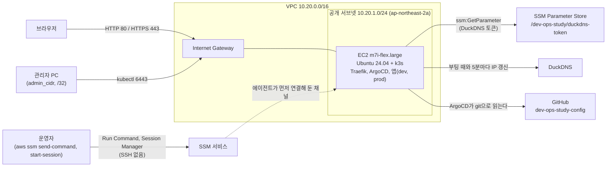

# infra/aws: EC2 한 대에 k3s와 ArgoCD를 올리는 Terraform

공부용 URL 단축 서비스를 AWS에서 돌려 보는 스택이다. EC2 인스턴스 한 대가 부팅하면서 스스로 k3s를 설치하고, ArgoCD를 깔고, 이 저장소의 `argocd/root.yaml`을 적용한다.
그 뒤는 로컬 클러스터와 같은 GitOps 흐름이다: ArgoCD가 이 저장소의 `main`을 읽어 dev·prod 앱을 배포한다.

**쓸 때 만들고, 안 쓸 때는 반드시 `terraform destroy`한다.** 인스턴스는 켜 둔 시간만큼 과금된다(아래 [비용](#비용)).
NAT Gateway, 로드 밸런서(ALB/NLB), EKS는 쓰지 않는다. 인스턴스는 한 대이고 고가용성은 목표가 아니다.

## 구성도



- **들어오는 길은 셋이다.** 80·443(누구나), 6443(k3s API, 내 IP 하나만), 그리고 SSM(Run Command와 Session Manager). SSM은 인스턴스의 SSM 에이전트가 밖으로 먼저 연결을 걸어 두는 방식이라 인바운드 포트가 필요 없다. 22번(SSH)은 열지 않고 키 페어도 없다.
- **나가는 길은 IGW 하나다.** NAT Gateway가 없어서 인스턴스가 공인 IPv4를 직접 받는다(공개 서브넷). 공인 IP는 Elastic IP가 아니라 자동 할당이라 인스턴스를 멈췄다 시작하면 바뀌고, DuckDNS 업데이터가 이름을 새 IP로 갱신한다.
- **ArgoCD UI는 공개 주소가 없다.** 지금은 HTTPS가 없어서 공개하면 admin 비밀번호가 평문으로 인터넷을 지난다. `kubectl port-forward`로만 접속한다([접속하기](#접속하기)). HTTPS(cert-manager)가 붙은 뒤에 공개 Ingress를 다시 만든다.

## 파일별로 만드는 것

| 파일 | 내용 |
|---|---|
| `versions.tf` | Terraform `~> 1.16`, AWS 프로바이더 `~> 6.66`(정확한 버전은 잠금 파일) |
| `backend.tf` | S3 상태 백엔드(부분 구성: 버킷 이름은 `init` 때 넘긴다), S3 자체 잠금 |
| `providers.tf` | AWS 프로바이더, `default_tags`(`Project=dev-ops-study`, `ManagedBy=terraform`) |
| `variables.tf` | 입력 변수와 검증 |
| `network.tf` | VPC(10.20.0.0/16), 공개 서브넷(10.20.1.0/24, `<리전>a`), 인터넷 게이트웨이, 라우트 테이블(0.0.0.0/0 → IGW), 연결 |
| `security.tf` | 보안 그룹: 80·443은 전체, 6443은 `admin_cidr`만, 22 없음, 아웃바운드 전체 |
| `iam.tf` | EC2용 역할, `AmazonSSMManagedInstanceCore` 연결, 인라인 정책(DuckDNS 토큰 읽기 허용, 다른 파라미터 읽기 거부, SSM을 거친 복호화), 인스턴스 프로파일 |
| `ec2.tf` | Ubuntu 24.04 AMI 조회(Canonical의 SSM 공개 파라미터), 인스턴스 1대(IMDSv2 필수, gp3 30 GiB 암호화) |
| `cloud-init.yaml.tftpl` | 인스턴스가 첫 부팅에 쓰는 파일과 `devops-bootstrap.service`. 이 서비스가 부팅마다 AWS CLI(서명 검사), DuckDNS 갱신, k3s, Helm, ArgoCD, 네임스페이스와 DB Secret, 루트 Application을 맞춘다 |
| `test/` | 템플릿 렌더링 검사(`test/render.sh`, AWS에 접속하지 않는다. [오프라인 검증](#오프라인-검증)) |
| `outputs.tf` | 인스턴스 ID, 공인 IP, 앱 주소, SSM 셸 명령, kubeconfig와 ArgoCD 접속 명령 |
| `.terraform.lock.hcl` | 프로바이더 버전과 해시 고정(darwin_arm64, linux_amd64). 커밋한다 |

Terraform이 만드는 리소스는 15개다: VPC, IGW, 서브넷, 라우트 테이블, 테이블 연결, 보안 그룹, 보안 그룹 규칙 4개, IAM 역할, 관리형 정책 연결, 인라인 정책, 인스턴스 프로파일, EC2 인스턴스.

입력 변수:

| 변수 | 기본값 | 설명 |
|---|---|---|
| `duckdns_subdomain` | (필수) | DuckDNS 서브도메인. `.duckdns.org` 없이 |
| `admin_cidr` | (필수) | k3s API(6443)에 접속할 내 IP. 반드시 `/32` |
| `region` | `ap-northeast-2` | 리소스를 만들 리전 |
| `instance_type` | `m7i-flex.large` | 2 vCPU, 8 GiB. Free Tier 대상 유형이지만 이 계정은 유료 플랜이라 시간당 과금된다([비용](#비용)) |
| `k3s_version` | `v1.35.5+k3s1` | 로컬 k3d와 같은 버전 |
| `helm_version` | `v4.3.0` | ArgoCD 설치에만 쓰는 도구 |
| `argocd_chart_version` | `10.9.4` | `bootstrap/argocd/values.yaml`이 가정하는 차트 버전 |
| `duckdns_token_parameter` | `/dev-ops-study/duckdns-token` | 토큰을 담은 SSM 파라미터 이름(`/`로 시작) |
| `config_repo_url` | `https://github.com/seongj-un/dev-ops-study-config` | 부팅 중에 루트 Application을 가져올 저장소 |
| `config_repo_ref` | `main` | 그 저장소의 브랜치 또는 태그 |

출력: `instance_id`, `public_ip`, `urls`(prod, dev), `ssm_shell_command`, `kubeconfig_fetch_hint`, `argocd_access`.

이 문서의 명령 블록에는 `#` 주석을 넣지 않았다. zsh는 `interactivecomments` 옵션이 꺼져 있으면(기본값) 대화형으로 붙여 넣은 줄의 `#`을 주석으로 보지 않아서, 주석이 명령의 인자나 문법 오류가 된다. 설명은 블록 밖에 둔다.

## 준비물

1. **부트스트랩 스택을 적용해 둔다**(`infra/bootstrap`). 그 스택이 Terraform 상태를 담을 S3 버킷 `dev-ops-study-tfstate-<계정 ID>`와 예산 알림(월 $5 조기 경보, 월 $20 예산)을 만든다. **예산은 알림 메일만 보내고 지출을 막지 않는다.** 이 스택(`infra/aws`)은 그 버킷을 쓰기만 한다.
2. **DuckDNS 서브도메인과 토큰.** https://www.duckdns.org 에 로그인해 서브도메인을 하나 만들면 페이지 위쪽에 토큰이 보인다.
3. **토큰을 SSM Parameter Store에 SecureString으로 저장한다.** 인스턴스가 부팅할 때 이 값을 읽는다. 토큰은 Terraform 변수나 `user_data`에 넣지 않으므로 상태에도 남지 않는다.
   `read -rs`는 입력을 화면에 보여 주지 않는다. 첫 줄을 실행한 뒤 토큰을 붙여 넣고 Enter를 누른다.
   ```bash
   read -rs DUCKDNS_TOKEN
   aws ssm put-parameter --region ap-northeast-2 --name /dev-ops-study/duckdns-token \
     --type SecureString --value "$DUCKDNS_TOKEN"
   unset DUCKDNS_TOKEN
   ```
   - `--key-id`를 주지 않으면 기본 키(AWS 관리형 `aws/ssm`)로 암호화된다. `iam.tf`의 정책은 이 키를 전제로 한다.
   - 파라미터는 리전 단위라서 `var.region`과 같은 리전에 만든다.
4. **`apply` 전에 토큰 파라미터가 있는지 확인한다.** 파라미터가 없거나 이름·리전이 틀려도 `plan`과 `apply`는 성공한다(`iam.tf`는 이름으로 ARN 문자열을 만들 뿐 파라미터를 읽지 않는다). 그 실수는 인스턴스가 부팅한 뒤 부트스트랩 로그의 `경고: DuckDNS 갱신 실패`로만 드러난다.
   아래 명령은 값이 아니라 메타데이터(이름, 형식, 키, 수정 시각)만 보여 준다. `SecureString`과 `alias/aws/ssm`이 든 한 줄이 나와야 한다.
   ```bash
   aws ssm describe-parameters --region ap-northeast-2 \
     --parameter-filters 'Key=Name,Values=/dev-ops-study/duckdns-token' \
     --query 'Parameters[].[Name,Type,KeyId,LastModifiedDate]' --output table
   ```
   `aws/ssm` 키가 아직 없는 계정이어도 `plan`은 실패하지 않는다. `iam.tf`가 그 키를 별칭으로 조회(`DescribeKey`)할 때 KMS가 AWS 관리형 키를 만들기 때문이다.
5. **로컬 도구**: Terraform 1.16.x, AWS CLI v2, kubectl. [Session Manager 플러그인](https://docs.aws.amazon.com/systems-manager/latest/userguide/session-manager-working-with-install-plugin.html)(`brew install --cask session-manager-plugin`)은 대화형 셸(`ssm_shell_command`)을 열 때만 필요하다. 이 문서의 확인·복구 명령은 `aws ssm send-command`(Run Command)를 써서 플러그인 없이 된다.

## 실행 순서

1. 로그인하고 어느 계정인지 확인한다.
2. `infra/aws`에서 초기화한다. 상태 버킷 이름은 `backend.tf`에 없어서(부분 구성) `init` 때 넘긴다. 이 계정의 버킷은 `dev-ops-study-tfstate-803879842357`이다.
3. 계획을 만든다. 내 공인 IP를 `/32`로 넘긴다(k3s API 6443이 이 IP에만 열린다).
4. 계획을 읽고(리소스 15개 추가가 나온다) 적용한다. 저장한 계획 파일을 적용하므로 `-var`를 다시 주지 않는다.

```bash
aws login
aws sts get-caller-identity
cd infra/aws
terraform init -backend-config=bucket=dev-ops-study-tfstate-803879842357
terraform plan -out=aws.tfplan \
  -var duckdns_subdomain=내서브도메인 \
  -var admin_cidr="$(curl -s https://checkip.amazonaws.com)/32"
terraform apply aws.tfplan
```

버킷 이름은 `terraform init "$(terraform -chdir=../bootstrap output -raw backend_config_arg)"`로도 넘길 수 있다. 다만 이 방법은 부트스트랩의 로컬 상태 파일(`infra/bootstrap/terraform.tfstate`)이 있는 체크아웃, 곧 부트스트랩을 `apply`한 메인 체크아웃에서만 된다. 워크트리나 새로 clone한 곳에는 그 파일이 없어서 출력이 없다는 오류가 난다. 그래서 위처럼 버킷 이름을 그대로 쓴다.

`apply`는 인스턴스가 `running`이 되면 끝난다. **그 뒤에도 인스턴스 안에서 부트스트랩이 몇 분 동안 설치를 계속한다.** 아래 타임라인과 [진행 확인](#진행-확인)을 본다.

## 부팅 타임라인

아래 시간은 실제로 `apply`해서 잰 값이 아니라 각 단계가 보통 걸리는 시간을 더한 추정치다. 처음 `apply`한 뒤 실측으로 고쳐 적는다. 0:00은 `apply`가 끝난 때(인스턴스 `running`)다.

| 경과(추정) | 일어나는 일 | 부트스트랩 로그(`/var/log/devops-bootstrap.log`)에 보이는 것 |
|---|---|---|
| 약 0:30~0:45 | cloud-init이 runcmd에서 `devops-bootstrap.service`를 시작한다 | `시작 (이전 완료: 없음)`, `STEP: 1/8 unzip` |
| 약 1:30~2:30 | DuckDNS 이름이 새 IP를 가리킨다 | `STEP: 3/8 DuckDNS` 다음의 `DuckDNS: <서브도메인>.duckdns.org -> <IP>` |
| 약 2:30~4:00 | k3s 설치, 노드 Ready | `확인: k3s 노드 Ready` |
| 약 6~9분 | ArgoCD 설치와 루트 Application 적용이 끝나 부트스트랩 완료 | `완료(…초)`. `/var/lib/devops-bootstrap.done`이 생긴다 |
| 약 9~13분 | ArgoCD가 dev·prod 앱을 동기화해 `Synced`가 된다(앱, PostgreSQL, Redis 이미지 내려받기 포함) | 로그에는 없다. `kubectl -n argocd get applications`로 본다 |

앱 주소가 열리려면 위 동기화가 끝나고 DuckDNS 이름이 새 IP를 가리켜야 한다. DuckDNS 갱신은 부팅 때와 5분마다 돈다.

## 진행 확인

`cloud-init status --wait`로는 알 수 없다. cloud-init은 runcmd에서 부트스트랩 서비스를 `--no-block`으로 시작만 하고 끝나서, 설치가 한창일 때 이미 `status: done`이다. 대신 부트스트랩의 상태, 로그, 완료 표시를 본다.

로컬에 Session Manager 플러그인이 없어도 되도록 SSM Run Command(`send-command`)로 명령을 보내고 출력을 받는다. `infra/aws`에서 실행한다. 아래 명령은 로그 마지막 40줄, 서비스 상태(`systemctl is-active`), 완료 표시를 출력한다.

```bash
INSTANCE_ID=$(terraform output -raw instance_id)
CMD_ID=$(aws ssm send-command --region ap-northeast-2 --instance-ids "$INSTANCE_ID" \
  --document-name AWS-RunShellScript \
  --parameters '{"commands":["tail -n 40 /var/log/devops-bootstrap.log 2>&1 || true","echo state: $(systemctl is-active devops-bootstrap)","echo done: $(cat /var/lib/devops-bootstrap.done 2>/dev/null)"]}' \
  --query Command.CommandId --output text)
aws ssm wait command-executed --region ap-northeast-2 --instance-id "$INSTANCE_ID" --command-id "$CMD_ID"
aws ssm get-command-invocation --region ap-northeast-2 --instance-id "$INSTANCE_ID" --command-id "$CMD_ID" \
  --query StandardOutputContent --output text
```

- 인스턴스가 SSM에 등록되기 전(부팅 뒤 1~2분)에는 `send-command`가 `InvalidInstanceId`로 실패한다. 잠시 뒤 다시 한다.
- 다른 명령도 같은 방법으로 보낸다. `--parameters`의 `commands` 목록만 바꾸고 나머지 두 줄은 그대로 쓴다. 명령은 root로 돈다.
- 로그에는 단계마다 `STEP: <번호>/8 <이름>` 줄이 있어서 마지막 `STEP:`이 지금 단계다. `STEP: 6/8 ArgoCD`에서 오래 머무는 것은 정상이다(`helm --wait`가 최대 10분 기다린다). 단계가 실패하면 `실패: STEP <단계>, <줄>번 줄, 종료 코드 <코드>: <명령>` 줄이 남는다(줄 번호는 인스턴스의 `/usr/local/sbin/devops-bootstrap` 기준).
- `state:`와 `done:` 읽는 법:

| 출력 | 뜻 |
|---|---|
| `state: activating` | 부트스트랩이 도는 중이다. 실패한 뒤 60초 재시작을 기다리는 동안도 `activating`이라, 로그 끝에 `실패:` 줄이 있는지 함께 본다 |
| `state: inactive`, `done: <시각>` | 이번 부팅의 부트스트랩이 끝났다. 끝난 oneshot 서비스는 `active`가 아니라 `inactive`로 돌아간다 |
| `state: inactive`, `done:` 비어 있음 | 아직 시작 전이다(cloud-init이 runcmd에 닿기 전) |
| `state: failed` | 2시간 안에 3번 실패해서 systemd가 재시작을 멈췄다. 로그의 마지막 `STEP:`과 `실패:` 줄로 원인을 고친 뒤 아래처럼 다시 돌린다 |

완료 표시(`/var/lib/devops-bootstrap.done`)는 부트스트랩이 시작할 때마다 지워지고 끝까지 성공해야 다시 생긴다. 그래서 `done:`에 시각이 있으면 이번 부팅의 실행이 성공한 것이다.

### 실패한 부트스트랩 다시 돌리기

systemd는 실패한 부트스트랩을 60초 뒤 다시 시작하되 2시간 안에 3번(첫 시작 포함)까지만 한다. 아래 명령의 `INSTANCE_ID`는 [진행 확인](#진행-확인)의 첫 줄로 정한다. 그 2시간 안에는 손으로 한 `systemctl start`도 시작 제한(`start-limit-hit`)으로 거부되므로 `systemctl reset-failed`로 횟수를 먼저 지운다. `--no-block`은 설치가 끝나기를 기다리지 않고 바로 돌아오게 한다. 진행은 위 확인 명령으로 본다.

```bash
aws ssm send-command --region ap-northeast-2 --instance-ids "$INSTANCE_ID" \
  --document-name AWS-RunShellScript \
  --parameters '{"commands":["systemctl reset-failed devops-bootstrap","systemctl start --no-block devops-bootstrap"]}' \
  --query Command.CommandId --output text
```

인스턴스 셸(`ssm_shell_command`)에서는 `sudo /usr/local/sbin/devops-bootstrap`을 직접 돌려도 된다. systemd를 거치지 않으므로 시작 제한과 무관하고, 출력은 같은 로그에 쌓인다. 서비스와 동시에 돌지 않도록 잠금을 잡으므로, 서비스가 도는 중이면 `이미 실행 중이다`를 내고 끝난다.

### 재부팅할 때

인스턴스를 재부팅하거나 멈췄다 시작하면 부트스트랩이 다시 돈다. 이미 된 단계는 건너뛰고 DuckDNS 갱신과 k3s Ready 대기만 하므로 보통 30~60초 걸린다.
이 서비스는 `WantedBy=multi-user.target`인 oneshot이라 **재부팅할 때마다 부팅 완료(`multi-user.target`)가 부트스트랩이 끝나기를 기다린다.** 보통 30~60초이고, 단계가 멈추면 최악에는 `TimeoutStartSec`(45분)까지 기다린다.
의도한 동작이다. k3s와 SSM 에이전트는 이 서비스를 기다리지 않고 함께 뜨므로, 그동안에도 앱이 올라오고 SSM 명령이 된다.

## 접속하기

`infra/aws`에서 아래 출력을 보고, 출력된 명령을 그대로 붙여 넣는다. 차례대로 앱 주소(지금은 평문 HTTP), kubeconfig를 받는 명령, ArgoCD UI 접속 명령, 인스턴스 셸을 여는 명령(Session Manager 플러그인 필요)이다.

```bash
terraform output urls
terraform output -raw kubeconfig_fetch_hint
terraform output -raw argocd_access
terraform output -raw ssm_shell_command
```

- **앱**: `http://<서브도메인>.duckdns.org`(prod), `http://dev.<서브도메인>.duckdns.org`(dev). DuckDNS는 `<서브도메인>.duckdns.org` 아래의 모든 이름을 같은 IP로 풀어 준다.
- **kubeconfig**: SSH가 없으므로 SSM Run Command로 인스턴스의 `/etc/rancher/k3s/k3s.yaml`을 읽어 `~/.kube/dev-ops-study-aws.yaml`에 저장하고(나만 읽게 `600`), `server`를 `https://127.0.0.1:6443`에서 `https://<서브도메인>.duckdns.org:6443`으로 바꾼다. 부트스트랩이 k3s를 설치한 뒤(`STEP: 4/8 k3s` 이후)에만 된다.
  - **이 kubeconfig는 cluster-admin 자격 증명이다.** 저장소 밖(`~/.kube/`)에 두고 절대 커밋하지 않는다. `infra/aws` 안에 둔다면 그 폴더의 `.gitignore`가 `kubeconfig*`를 막지만, 저장소의 다른 폴더에는 그런 규칙이 없다.
  - `send-command`의 출력(곧 이 kubeconfig 전체, 클라이언트 키 포함)은 SSM의 명령 기록에 약 30일 남는다. 그동안 이 계정에서 `ssm:GetCommandInvocation` 권한이 있는 사람은 다시 읽을 수 있다. `destroy`하면 그 자격 증명이 가리키던 클러스터는 사라진다.
- **ArgoCD UI**: 공개 주소가 없다. kubeconfig를 받은 뒤 `argocd_access`의 명령을 붙여 넣는다. 초기 admin 비밀번호를 출력하고 포트 포워딩을 띄운다. 브라우저에서 http://localhost:8080 을 열고 `admin`으로 로그인한다. 포트 포워딩은 Ctrl-C로 끝낸다.
  이 연결은 k3s API 서버(6443)를 지난다. 6443은 TLS이고 보안 그룹이 `admin_cidr`에만 열어 두므로 비밀번호가 평문으로 나가지 않는다.
- **k3s 인증서에는 DuckDNS 이름만 있고 공인 IP는 없다**(`--tls-san`). 공인 IP는 Elastic IP가 아니라서 멈췄다 시작할 때마다 바뀐다. 설치할 때의 IP를 인증서에 넣어도 곧 틀린 값이 되지만, 이름은 DuckDNS가 새 IP로 옮겨 주므로 계속 맞는다.
  DuckDNS가 아직 옛 IP를 가리킬 때(시작 직후, 또는 DuckDNS 갱신이 실패할 때)는 kubeconfig의 `server`를 지금 IP로 바꾸고, 인증서 검사에 쓸 이름을 `tls-server-name`으로 따로 준다. 아래 `내서브도메인`을 바꿔 실행한다.
  ```bash
  IP=$(aws ec2 describe-instances --region ap-northeast-2 --instance-ids "$(terraform output -raw instance_id)" \
    --query 'Reservations[0].Instances[0].PublicIpAddress' --output text)
  kubectl --kubeconfig "$HOME/.kube/dev-ops-study-aws.yaml" config set-cluster default \
    --server="https://$IP:6443" --tls-server-name=내서브도메인.duckdns.org
  ```
  `terraform output public_ip`는 `apply` 때의 IP라서 멈췄다 시작한 뒤에는 틀릴 수 있어 EC2 API에서 지금 IP를 읽는다. DuckDNS가 따라잡으면 `--server=https://내서브도메인.duckdns.org:6443`으로 되돌린다(`tls-server-name`은 남겨 둬도 된다).

## 비용

아래는 **2026-10-01에 확인한 서울 리전(ap-northeast-2) 온디맨드 가격**이다. 가격은 바뀌므로 공식 페이지로 다시 확인한다: [EC2 요금](https://aws.amazon.com/ec2/pricing/on-demand/), [퍼블릭 IPv4 주소 요금(VPC)](https://aws.amazon.com/vpc/pricing/), [EBS 요금](https://aws.amazon.com/ebs/pricing/).

| 항목 | 단가 | 시간당 |
|---|---|---|
| EC2 `m7i-flex.large`(Linux) | $0.11771/시간 | $0.11771 |
| 공인 IPv4(자동 할당 주소도 같은 요금) | $0.005/시간 | $0.005 |
| gp3 30 GiB | $0.0912/GB-월(30 GiB면 월 $2.736) | 약 $0.0037(한 달 730시간 기준) |
| **합계** | | **약 $0.1265** |

켜 둔 시간에 비례한다. 하루(24시간)면 약 $3.03, 730시간(한 달 내내)이면 약 $92다.

- **`m7i-flex.large`는 Free Tier 대상 인스턴스 유형이지만 이 계정은 유료 플랜이라 시간당 과금된다.** 사용액은 남은 크레딧에서 먼저 빠지고, 크레딧을 다 쓰면 등록한 카드로 청구된다.
- **예산(`infra/bootstrap`)은 알림만 보내고 지출을 막지 않는다.** 월 $5 조기 경보나 월 $20 예산을 넘어도 메일이 올 뿐 인스턴스는 계속 돈다. 알림은 비용 데이터가 하루에 몇 번만 갱신되어서 늦게 온다. 알림에 기대지 말고 끄는 습관이 먼저다.
- 인스턴스를 지우면 볼륨도 함께 지워진다(`delete_on_termination`). 볼륨만 남으면 인스턴스가 없어도 계속 과금된다.
- 이 스택에는 NAT Gateway와 로드 밸런서가 없다(있었다면 각각 시간당 요금이 붙는다). Elastic IP도 없다: 고정 IP가 필요 없고, 공인 IPv4는 자동 할당이든 Elastic IP든 같은 시간당 요금이라 써도 줄어드는 비용이 없다.
- 들어오는 트래픽(패키지와 이미지 내려받기)은 무료이고, 나가는 트래픽은 이 실습 규모에서는 미미하다.
- S3 상태 파일, SSM Parameter Store(표준 파라미터), Session Manager, Run Command, DuckDNS는 사실상 무료다.

### 안 쓸 때는 destroy한다

```bash
terraform destroy \
  -var duckdns_subdomain=내서브도메인 \
  -var admin_cidr="$(curl -s https://checkip.amazonaws.com)/32"
```

- `destroy`에도 같은 변수가 필요하다(값은 검증만 통과하면 된다). 리전은 만들 때와 같아야 한다(기본값을 바꾸지 않았다면 신경 쓸 것이 없다).
- **인스턴스 안의 모든 것이 사라진다.** PostgreSQL 데이터, ArgoCD 설정, kubeconfig가 가리키던 클러스터까지. 공부용이라 괜찮고, 그래서 다시 `apply`하면 처음부터 같은 상태로 올라온다.
- 끝난 뒤 남은 것이 없는지 확인한다. 종료된 인스턴스는 한 시간쯤 `terminated`로 목록에 남는다(과금되지 않는다). 두 번째 명령의 결과(남은 볼륨)는 비어 있어야 한다.
  ```bash
  aws ec2 describe-instances --region ap-northeast-2 --filters Name=tag:Project,Values=dev-ops-study \
    --query 'Reservations[].Instances[].{id:InstanceId,state:State.Name}' --output table
  aws ec2 describe-volumes --region ap-northeast-2 --filters Name=tag:Project,Values=dev-ops-study \
    --query 'Volumes[].VolumeId' --output text
  ```

## 보안 메모

- **SSH가 없다.** 22번을 열지 않고 키 페어도 없다. 셸과 명령은 SSM(Session Manager, Run Command)으로 보낸다: IAM으로 인증하고, `StartSession`·`SendCommand` 호출이 CloudTrail에 남는다.
- **k3s API(6443)는 내 IP 하나(`admin_cidr`, `/32`)에만 열린다.** 변수 검증이 `/32`가 아닌 값(특히 `0.0.0.0/0`)을 막는다. 공인 IP가 바뀌면 `admin_cidr`를 새 값으로 `apply`한다(보안 그룹 규칙만 바뀌고 인스턴스는 그대로다).
- **kubeconfig는 cluster-admin이다.** 받은 파일이 새면 `admin_cidr` 안의 누구나 클러스터를 지배한다. 나만 읽게 두고, 저장소에 올리지 않고, 실습이 끝나면 지운다(`destroy`하면 그 자격 증명이 가리키던 클러스터도 사라진다). 같은 내용이 SSM 명령 기록에 약 30일 남는다는 점도 기억한다([접속하기](#접속하기)).
- **ArgoCD UI는 인터넷에 공개하지 않는다.** 위 [접속하기](#접속하기)의 port-forward만 쓴다.
- **80·443은 전 세계에 열려 있다.** 지금은 평문 HTTP라서 앱에 실제 개인 정보나 중요한 비밀번호를 넣지 않는다. k3s의 Traefik은 443에서도 이미 듣는다. 신뢰할 수 있는 인증서를 붙이기 전인 지금은 Traefik이 만든 자체 서명 기본 인증서로 응답하므로 `https://`로 열면 브라우저가 경고를 띄운다. HTTPS(cert-manager + Let's Encrypt)는 나중에 붙인다.
- **IMDSv2 필수, 홉 제한 1.** 파드 안에서는 인스턴스 메타데이터에 닿지 못해서, 파드가 침해되어도 인스턴스 역할을 가져갈 수 없다(호스트 네트워크를 쓰는 `hostNetwork: true` 파드는 예외이므로 띄우지 않는다).
- **인스턴스 역할은 DuckDNS 토큰 하나만 읽는다.** SSM 에이전트용 관리형 정책 `AmazonSSMManagedInstanceCore`는 `ssm:GetParameter`·`ssm:GetParameters`를 모든 파라미터(`Resource "*"`)에 허용하고, `aws/ssm` 키의 키 정책은 같은 계정의 모든 주체에게 SSM을 거친 복호화를 허용한다. 그대로 두면 이 역할이 계정의 다른 파라미터와 SecureString까지 읽는다.
  그래서 인라인 정책에 명시적 Deny(`DenyOtherParameters`)를 넣어, 토큰 파라미터가 아닌 모든 파라미터에 대해 값을 돌려주는 API 넷(`GetParameter`, `GetParameters`, `GetParametersByPath`, `GetParameterHistory`)을 막는다. 명시적 Deny는 어느 Allow보다 우선한다. Session Manager 셸과 Run Command는 파라미터를 읽지 않으므로 영향이 없다.
  그 밖의 허용은 토큰 파라미터에 대한 `ssm:GetParameter`와, SSM을 거칠 때만 `aws/ssm` 키로 하는 `kms:Decrypt`뿐이다.
- **비밀은 코드·상태에 없다.** DuckDNS 토큰은 SSM에만 있고, DB 비밀번호는 인스턴스 안에서 생성된다. DB 비밀번호는 명령줄 인자·로그·임시 파일에 쓰지 않지만 Secret으로 k3s 데이터 저장소(암호화된 EBS 볼륨)에 저장된다. k3s는 Secret을 따로 암호화하지 않아서(base64일 뿐이다) 그 보호는 EBS 암호화다.
  `user_data`(cloud-init 전체)는 암호화되지 않아 인스턴스에 접속한 사람과 EC2 API로 조회할 권한이 있는 누구나 읽을 수 있고 Terraform 상태에도 들어가므로, 그 안에는 비밀을 넣지 않는다.
- **내려받는 도구를 검사한다.** AWS CLI는 최신 zip과 그 `.sig`를 받아, `user_data`에 넣어 둔 AWS CLI 팀 PGP 공개 키([AWS CLI 설치 문서](https://docs.aws.amazon.com/cli/latest/userguide/getting-started-install.html)의 블록, 지문 `FB5D B77F D5C1 18B8 0511 ADA8 A631 0ACC 4672 475C`, 만료 2027-07-01)로 `gpgv` 서명 검사를 통과해야 푼다.
  k3s 바이너리는 설치 스크립트가 같은 릴리스의 sha256 목록으로, Helm은 `get.helm.sh`의 `.sha256sum`으로 검사한다. 이 둘은 같은 곳에서 받은 체크섬이라 전송 중 손상은 잡지만 배포 서버가 통째로 바뀐 경우는 막지 못한다.
- **상태 파일은 S3에 있다**(부트스트랩 스택이 만든 버킷). 요청에서도 암호화를 명시하고, S3 자체 잠금으로 동시 `apply`를 막는다.

## 자주 만나는 문제

인스턴스 안의 확인과 조치는 [진행 확인](#진행-확인)의 `send-command` 방법으로 한다(`commands` 목록만 바꾼다. `INSTANCE_ID`도 거기서 정한다).

| 증상 | 원인과 해결 |
|---|---|
| 부트스트랩 로그에 `경고: DuckDNS 갱신 실패`가 있고 이름이 새 IP를 가리키지 않는다 | 토큰 파라미터가 없거나 이름·리전이 틀렸거나(`ParameterNotFound`), 토큰이나 서브도메인이 틀렸다(DuckDNS가 `KO`). `plan`·`apply`는 이것을 잡지 못한다. [준비물](#준비물) 4번의 `describe-parameters`로 파라미터를 확인한다. 오류 내용은 첫 실행분이 부트스트랩 로그에, 그 뒤 타이머 실행분이 `journalctl -u duckdns-update -n 20 --no-pager`에 있다. 고치면 타이머가 5분 안에 다시 갱신한다. |
| 로그 끝이 `실패: STEP 2/8 AWS CLI, … gpgv …`이고 그 위에 `BAD signature` 또는 `Can't check signature: No public key`가 있다 | AWS CLI zip의 서명 검사가 실패했다. 내려받기가 깨진 것이면 systemd의 재시작에서 풀린다. `No public key`가 계속되면 AWS가 서명 키를 바꾼 것이다: [AWS CLI 설치 문서](https://docs.aws.amazon.com/cli/latest/userguide/getting-started-install.html)의 공개 키 블록으로 `cloud-init.yaml.tftpl`의 `/etc/devops/aws-cli.asc`와 `test/container-checks.sh`의 지문을 고친다. `user_data`가 바뀌므로 인스턴스가 교체된다. |
| 로그 끝이 `실패: STEP 6/8 ArgoCD, …`이고 그 위에 `another operation (install/upgrade/rollback) is in progress`가 있다 | 첫 ArgoCD 설치가 중간에 끊겨(재부팅, 시간 초과) Helm 릴리스가 `pending-install`에 걸렸다. 부트스트랩은 릴리스가 `deployed`가 아니면 다시 설치하는데, Helm은 이 상태의 릴리스를 건드리지 않는다. 릴리스를 지우고 부트스트랩을 다시 돌린다(아래 명령). |
| `kubectl get pods -A`에 `ErrImagePull`이나 `ImagePullBackOff`가 있고 `kubectl describe pod`의 이벤트에 `toomanyrequests`가 보인다 | Docker Hub가 로그인하지 않은 내려받기를 IP마다 횟수로 제한한다. Docker Hub에서 받는 것은 k3s 기본 구성 요소(`rancher/...`: Traefik, CoreDNS 등)와 앱의 PostgreSQL·Redis다(ArgoCD 이미지는 quay.io와 ECR Public이라 무관하다). 기다리면 된다: 제한이 풀리면 kubelet이 다시 받아 저절로 뜬다. |
| [진행 확인](#진행-확인)의 상태가 `state: failed`다 | 2시간 안에 3번 실패해서 systemd가 재시작을 멈췄다. 로그의 마지막 `STEP:`·`실패:` 줄로 원인을 고친 뒤 [실패한 부트스트랩 다시 돌리기](#실패한-부트스트랩-다시-돌리기)의 명령을 쓴다(`systemctl reset-failed`가 먼저다). |
| `send-command`가 `InvalidInstanceId`로 실패한다 | 인스턴스가 아직 SSM에 등록되지 않았다(부팅 뒤 1~2분). `aws ssm describe-instance-information --region ap-northeast-2`에 인스턴스가 `Online`으로 나올 때까지 기다린다. |
| `ssm start-session`이 `TargetNotConnected`로 실패한다 | 위와 같은 이유다. `Online`이 될 때까지 기다린다. |
| `ssm start-session`이 `SessionManagerPlugin is not found`로 실패한다 | 로컬에 Session Manager 플러그인이 없다. 설치하거나(`brew install --cask session-manager-plugin`), 이 문서의 `send-command` 방법을 쓴다. |
| `apply`가 "이 가용 영역에서 인스턴스 유형을 지원하지 않는다" 또는 `InsufficientInstanceCapacity`로 실패한다 | 서브넷이 `<리전>a`에 있어서 그 영역에 유형이나 용량이 없는 경우다. `network.tf`의 `availability_zone`을 다른 영역(`b`, `c`, `d`)으로 바꾸거나 잠시 뒤 다시 시도한다. |
| `kubectl`이 응답 없이 멈춘다 | 내 공인 IP가 바뀌어서 6443이 막혔다. `-var admin_cidr="$(curl -s https://checkip.amazonaws.com)/32"`로 다시 `apply`한다. |
| `kubectl`이 `x509: certificate is valid for …` 같은 인증서 오류를 낸다 | kubeconfig의 `server`를 IP로 바꾸면서 `tls-server-name`을 주지 않았다. [접속하기](#접속하기)의 방법대로 이름을 준다. |
| `apply`는 끝났는데 앱 주소가 안 열린다 | 부트스트랩이나 ArgoCD 동기화가 아직 진행 중이거나([진행 확인](#진행-확인)), DuckDNS 이름이 새 IP를 가리키지 않는다. `dig +short <서브도메인>.duckdns.org`의 결과를 `terraform output public_ip`와 비교한다. 다르면 업데이터가 돌 때까지(최대 5분) 기다린다. |
| `plan`이 인스턴스 교체를 보여 준다 | 설계대로다. `user_data`가 바뀌면(`cloud-init.yaml.tftpl`이나 `bootstrap/argocd/values.yaml`의 값을 고치면) 인스턴스를 교체한다(`user_data_replace_on_change`). 인스턴스 안의 데이터는 사라진다. |
| 새 AMI를 쓰고 싶다 | `ami`는 `ignore_changes`라서 Canonical이 새 이미지를 내도 plan에 나타나지 않는다. `terraform apply -replace=aws_instance.k3s`로 일부러 교체한다(다음 `apply`는 어차피 그때의 최신 AMI로 만든다). |

Helm 릴리스가 `pending-install`에 걸렸을 때. 첫 명령이 릴리스 상태를 출력하고(`STATUS: pending-install`), 릴리스를 지운 뒤 부트스트랩을 다시 시작한다. 지워도 ArgoCD의 CRD는 남고(차트가 지우지 않게 표시해 둔다), 다시 설치할 때 그대로 이어받는다.

```bash
aws ssm send-command --region ap-northeast-2 --instance-ids "$INSTANCE_ID" \
  --document-name AWS-RunShellScript \
  --parameters '{"commands":["export HOME=/root KUBECONFIG=/etc/rancher/k3s/k3s.yaml","helm -n argocd status argocd || true","helm -n argocd uninstall argocd","systemctl reset-failed devops-bootstrap","systemctl start --no-block devops-bootstrap"]}' \
  --query Command.CommandId --output text
```

## 이 스택의 설계 메모

- **`user_data`는 gzip으로 압축해서 넘긴다**(`user_data_base64 = base64gzip(...)`). EC2는 user data를 base64로 바꾸기 전 바이트 기준 16 KiB까지만 받는다. 렌더링한 cloud-init은 한글 주석(UTF-8에서 글자당 3바이트), AWS CLI 서명 키, 스크립트가 들어가서 원문이 이미 한도를 넘는다(2026-10-01 기준 약 21.8 KB).
  압축하면 약 10.2 KB이고 한도는 이 압축본에 걸린다. `test/render.sh`가 Terraform과 같은 식으로 압축본을 만들어 크기를 검사하고, cloud-init의 함수로 풀어 원문과 같은지도 본다. cloud-init은 gzip으로 압축된 user data를 스스로 풀어서 처리한다. `plan`에서 `user_data_base64`가 긴 base64 문자열로 보이는 것은 정상이다.
  다만 압축 결과의 바이트는 Terraform을 빌드한 Go 버전에 따라 달라질 수 있다. Terraform을 올린 뒤 살아 있는 인스턴스에 `plan`하면 내용이 같아도 교체가 제안될 수 있다. 그 교체는 `apply`하지 말고 그 세션이 끝난 뒤 `destroy`한다.
- **`user_data_replace_on_change = true`.** cloud-init은 첫 부팅 때 한 번만 실행해서, `user_data`만 바꾸면 바뀐 스크립트가 실행되지 않은 채 반영된 것처럼 보인다. 교체하면 항상 현재 코드가 만든 그대로 부팅한다.
- **설치는 cloud-init이 아니라 systemd 서비스가 한다.** cloud-init의 `write_files`·`runcmd`는 인스턴스의 첫 부팅에만 돈다. 그래서 cloud-init은 파일을 쓰고 `devops-bootstrap.service`를 켜기만 하고, 그 서비스가 부팅마다 돌며 이미 된 단계는 건너뛴다. 실패하면 systemd가 60초 뒤 다시 시작한다(2시간 안에 3번까지).
- **k3s 인증서에 공인 IP를 넣지 않는다.** 멈췄다 시작할 때마다 바뀌는 IP 대신 DuckDNS 이름을 넣는다([접속하기](#접속하기)에 이유와 우회 방법).
- **NAT 없이 공개 서브넷.** NAT Gateway는 시간당 요금과 처리 데이터 요금이 붙는다. 대신 인스턴스가 공인 IP를 직접 가지므로 들어오는 길을 보안 그룹으로 좁게 닫는다.
- **보안 그룹 규칙은 `aws_vpc_security_group_*_rule`로 하나씩 만든다.** 그룹 안의 인라인 규칙은 섞어 쓰면 서로 덮어쓰고, 규칙별 ID·설명·태그를 다루기 어렵다. 보안 그룹과 규칙의 `description`은 영문 ASCII만 허용되어서 한글 설명은 코드 주석에 있다.

## 오프라인 검증

AWS 자격 증명 없이 할 수 있는 정적 검증이다(`plan`·`apply`는 자격 증명이 필요하다). `cloud-init.yaml.tftpl`이 있어야 `validate`가 돈다(`templatefile`이 그 파일을 읽는다). 차례대로 형식, 초기화(백엔드 없이), 문법·참조 검사, Trivy 설정 검사, 템플릿 렌더링 검사([test/README.md](test/README.md))다.

```bash
cd infra/aws
terraform fmt -check -recursive
terraform init -backend=false
terraform validate
docker run --rm -v "$PWD/../..":/w aquasec/trivy:0.70.0 config /w/infra/aws
test/render.sh
```

프로바이더를 올릴 때는 `terraform providers lock -platform=darwin_arm64 -platform=linux_amd64`로 잠금 파일의 해시를 다시 받는다.

Trivy 0.70.0은 이 구성에서 지적 사항이 없다. 지적되는 것 가운데 의도한 설정 셋은 해당 리소스 위의 `# trivy:ignore:` 주석으로 예외 처리하고 이유를 그 위에 적어 두었다: 공개 서브넷의 공인 IP 자동 할당(AWS-0164), 아웃바운드 전체 허용(AWS-0104), VPC 흐름 로그 없음(AWS-0178: 요금만 들고 조사할 일이 없다). 80·443의 전체 공개는 Trivy가 웹 포트로 보고 지적하지 않는다(같은 규칙을 22번으로 바꾸면 AWS-0107로 잡히는 것을 확인했다). 그래서 그 규칙에는 예외 주석이 없다.
